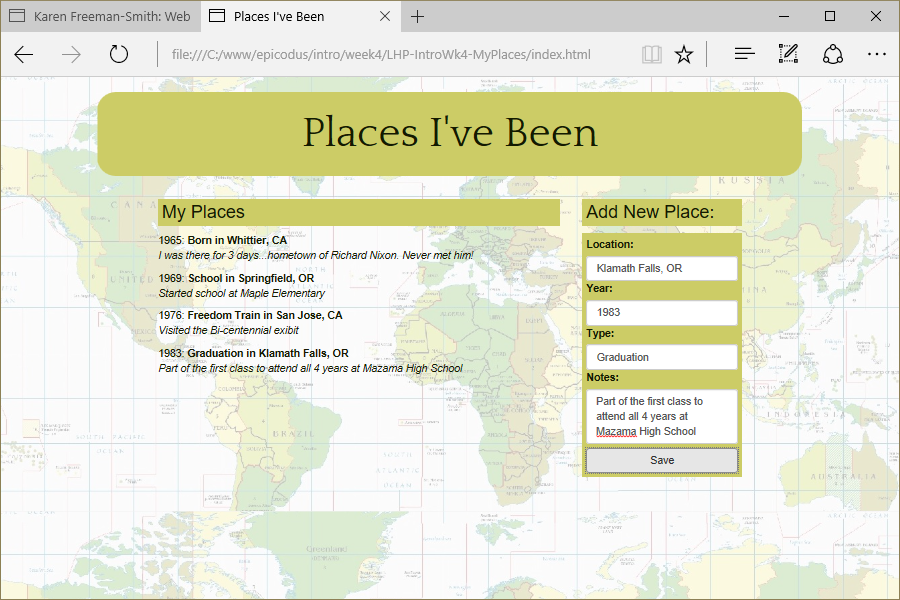

# My Places
Version 0.0.1: May 1, 2016
by [Karen Freeman-Smith](https://karenfreemansmith.github.io)

### Technologies Used
HTML, CSS, Bootstrap, JavaScript, jQuery

## Description
*[Learn How To Program](http://learnhowtoprogram.com) Intro to Programming Week 4 Individual Project: A website that keeps track of places you've been.*

## Setup/Installation
* [View on Github Pages](https://karenfreemansmith.github.io/LHP-IntroWk4-MyPlaces)
* _OR_
* Clone directory
* Open index.html in your favorite browser

## Support & Contact
For questions, concerns, or suggestions please email karenfreemansmith@gmail.com

## Specifications
Make a website where you can enter places you've been. Each place will be an object that can have a couple different properties, like location, landmarks, time of year, notes, etc. Then display those properties when a user clicks on each place. Make sure to do the business logic for your place object first.

## Known Issues
* None

## Legal
*Licensed under the GNU General Public License v3.0*

Copyright (c) 2016 Copyright _[Karen Freeman-Smith](https://karenfreemansmith.github.io)_ All Rights Reserved.
